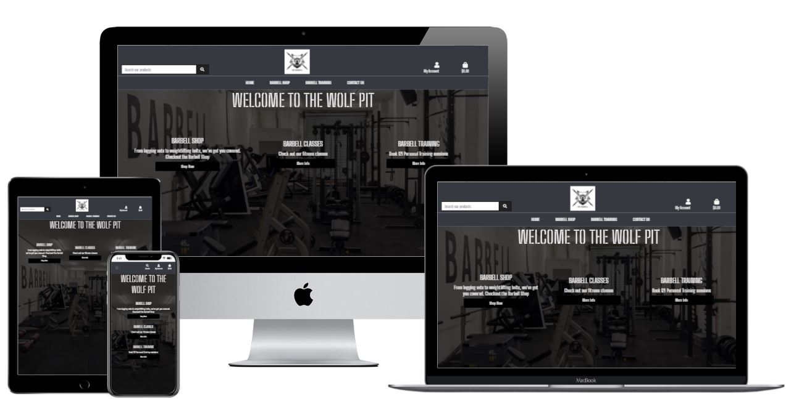
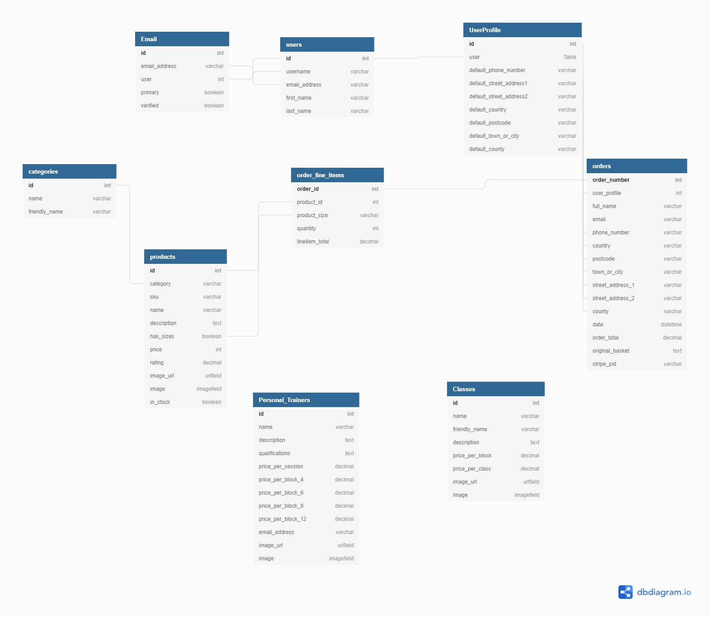

<h1 style="text-align: center">The Barbellgym.com </h1>

This is my submission for Milestone project 4 for Code Institute. The Barbellgym.com is a site for existing and new members of the Barbell Gym to
get information, purchase merchandise and send enquiries on classes and personal training. The goal for this site is to be used to generate income
for the owner of the Barbell Gym and a 'one stop shop' for all new an existing members. 

Live project: [https://thebarbellgym.herokuapp.com/]

### User Experience (UX) ###

* User Story 1 - As a customer, I land on the hompeage of the site and It's clear what the business is.
* User Story 2 - As a customer I can navigate easily to any section of the site regardless of where I am or what device I am using.s
* User Story 3 - As a customer I can easily access the Contact Us page and social media channels through the Footer of the page.
* User Story 4 - As the business owner, I provide customers with a clear and consistent UX in-keeping with the Barbell Gym brand.
* User Story 5 - As a user, I can easily access the different products available from the Barbell shop.
* User Story 6 - As a user, if applicable, I can choose the colour and size of my product before adding to the basket.
* User Story 7 - As a user, I am notified when I have successfully added a product to the basket and the quantity of products added is shown next to the basket icon.
* User Story 8  - As a user I can submit my enquiry about a class or PT session.
* User Story 9 - As an Admin/Superuser I can edit or delete a product.
* User Story 10 - As a customer, when I go to the basket page I can see the the products I have added to basket and overall total of my order.
* User Story 11 - As a customer I can remove a specific item from my basket.
* User Story 12 - As a customer I can adjust the quantity of specific items in my cart.
* User Story 13 - As a customer I can remove all items from my basket with one click.
* User Story 14 - As a customer, I can proceed to the checkout page from the basket review page.
* User Story 15 - As a customer I can choose to save my payment details for next time I make an order.
* User Story 16 - As a customer, through the contact us page I can access the business'  social media accounts and their location on google maps.
* User Story 17 - As a user, I can sign into my account which gives me access to my order history and payment details.
* User Story 18 - As a user, If i'm not signed up I can register for an account.
* User Story 19 - As a customer when I am signed in, I can access my order history, and see my previous orders.

### Design ###

* Colour scheme - The colour scheme is black and white matching the brand and ethos of the business.

* Typography - the 'Big Shoulders Stencil Text' font is used as it is bold, easy to read and suits the military old school
feel of the brand.

* Imagery - The Barbell Gym logo nd images from the gym are shown throughout the site to draw attention as the business' distinctive features. Background images include images
from the gym and classes to provide an insight to users of what the gym looks like, can be seen throughout various pages of the site. Images of the products
were used to show what the products looked like.

* WireFrames:
Desktop and Mobile wireframes - [https://marvelapp.com/prototype/2c593h96]

* Entity relationship diagram

There are 6 models set up in Django DB
    
    Users
    UserProfiles
    Emails
    Orders
    Order line item
    Categories
    Products
    Classes
    Personal Trainers

* The sign in/registration/verification functionality is provided by the built-in Django Allauth,
  Integrated set of Django applications addressing authentication, registration, account management
  as well as 3rd party (social) account authentication. more here - [https://django-allauth.readthedocs.io/en/latest/]
* When a user registers, they provide their own username, password and email-address, which is then used to login,
  once email is verified. The email is assigned to the User id. once logged in this creates a session. The session id
  is then used to permit/restrict access for that user. i.e. if the user has Superuser access (granted by an admin) then
  they will have access to the Class, Product and PT management options in the menu. If not they will only be able to see their profile.
* In their UserProfile, they will be able to access their delivery information if they have opted to save it when placing an order and
  any orders they have placed. the user will be able to see order number, order details (products, sizes quantity, order date) and order total.
  There is a function to update their delivery information which should pre-populate the delivery address form when the next order is placed.
* Once an order has been placed, an email confirmation will be sent to the email address either pre-populated from the UserProfile Id if the
  info has been saved, or whichever email address is submitted to the order form.
* The orders are comprised of Order line-items which attaches itself to the order id and provides details on each product, the quantity, the sizes
  ordered and the price.
* The information in the OrederLine item depends on the products selected. The order_line_item is generated when the product id are called from
  the basket. The product id will determine the name of the product, whether or not that product has sizes, the availble sizes in that product and the price.
  There is also a in_stock boolean field that allows the admin to push products out of stuck, which prevents customers from adding it to their basket.
* The products are placed into categories, adn each catgeory id detrmines which product is in that category. This allows groups of products to be searched
  together and helps with customer navigation of the site.
* The Classes and Personal trainer model is part of the training app and are services provided by the Barbell gym, they do not relate to any other model.
* If a user has Superuser access they can access the management elements of the nav bar. This allows them to add products, classes and personal trainers to the site.
  They can also access the edit and delete functionality for any of the instances of the aformentioned models, by targeting the id of that instance. The edit function
  takes the user to a form which is pre-populated with the existing instances details which can then be altered.

* Features:
    * Responsive layout on mobile and tablet
    * Collapsible nav bar for mobile view
    * Authentication (Login/Register/email verification functionality)
    * Search
    * Defensive programming
    * Integrated with Stripe to take payments
    * Sends out confirmation emails through gmail
    * Inbuilt feedback system to keep user informed

### Technologies: ###

* Languages - 
HTML5
CSS3
JS
Python

* Frameworks/libraries/programs - 
  https://favicon.io/favicon-converter/ - Used to create logo for title.

  https://fonts.google.com/ - used for font design.

  https://www.rawpixel.com/image/2337562/free-illustration-png-frame-black-texture - Used for background image.

  Django - https://www.djangoproject.com/ to run site on and use of Jinja templating and builtin functionality (e.g. allauth).

  Bootstrap - https://getbootstrap.com/ Used for responsiveness and design of site,
  used to implement responsive header

  Heroku - https://www.heroku.com/ cloud based platform used to deploy the Barbell planner.

  Free formatter - https://www.freeformatter.com/css-beautifier.html used to beautify CSS3 code.

  W3C markup Validator - https://validator.w3.org/ to check HTML formatting.

  JS Hint - https://jshint.com/ - to test JQuery formatting.

  db diagram - https://dbdiagram.io/ - to create entity relationship diagram

  

### Testing

The W3C Markup Validator, W3C CSS, JSHint PEP8 online Validator Services were used to validate the project pages to ensure
there were no syntax errors.

* [W3C Markup validator](https://validator.w3.org/#validate_by_input)
  1 error were found across multiple pages: - 'unclosed element div'. Fix - added in missing closing tag
  1 error found across all pages 'Duplicate id' Fix - this has not been addressed as the id appears on the
  page source for 2 different html pages and is required for the drop-down element of the nav-bar.
  1 error found at checkout page 'for attribute for label element must be id of non-hidden form'
    Fix - this has been left as id is present in the form, checkout.html, line 92.
  1 error found across training pages - 'p element no allowed as child of h5 in this context'
    Fix - removed surrounding tags from templating logic that includes 'linebreaks' as this
    automatically generates paragraph tags.

* [W3C CSS validator](https://jigsaw.w3.org/css-validator/validator) No errors were returned from the CSS validator

* [JSHint](https://jshint.com/)

* [PEP8 online](http://pep8online.com/checkresult)

### Testing user stories ###

### Further testing ###
     

* Bugs:

* Potential enhancements:

<h2 style="text-align: center">Deployment</h2>

### Credits

### Code ###

### Content ###

#### Image credits ####

### Acknowledgements ###
